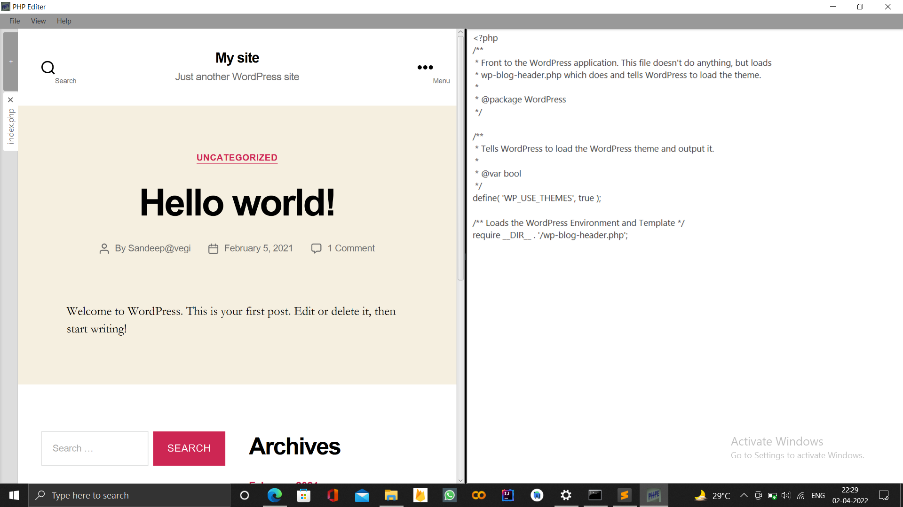

# Live Php Editor

 This Editer 🖊 is created with the help of java ☕. It presents the use of simple java IO ✍ to make some creative Apps. Basic understanding of java and javafx is enough to customize 🛠 this accourding to your needs.
 
## Requirements
- JDK 9 ☕ or any JDK with javafx lib (Some changes in import code section is needed in order to use openfx)
- Php 
 
## Feature

- Handle multiple 🔢 tab at a time
- Very lightweight 🍃
- Uses simple java IO ✍

## Source code structure
```
./Editer.css
./PHPServer.java
./phpe2.png
...
```
Ignore any extra files in source code.
Let's take a look att code.
1. `Editer.css` - This defines css 🎨 for application. Javafx supports css integration in code this provides javafx an edge over other GUI tool such as `Swing` or `AWT`.
2. `PHPServer.java` - This is main class to handle all action from taking input to rendering output and showing to the user.
3. `phpe2.png` - It's only logo for application .

## Working
So how all this works ? So answer is very simple, just using java IO ✍. There are mainly two componets in GUI of application.
1. TextArea GUI components
2. WebView GUI components

When user type Php code 👨‍💻 into TextArea the corresponding result is shown in the WebView components.
Let's take a look at the process behind the the seen.
1. The code written by the user is fetched by the application and written to a temporary php file 📝 after every keystroke.
2. The generated file📝 then executed⚙ by the php program to generate equaivalent html code which is saved to another temporary file📝.
3. The generated Html response file by php code is loaded into WebView.
4. That's all 🎯.

Note:- If the source file📝 is used instead of new file then at the end when user press `Ctrl+S` or choose save from menu
the current state of file in saved to source file. As is should be.


## Screenshot 




## What can be improved
- Syntax  highlighting
- Links 🔗 opening behaivour, Mainly for `target="_blank"`
